# Live-Fire Exercises: Security in Django

John Hess

.fx: titleslide

<!-- 

## Who am I?

* Software Engineer, Data Scientist, Product Manager, Engineering Manager
* Security-Curious
    * YMMV, IANASR, RTM, TLA, etc.
    * I am probably *not* the expert in this room
* I write software at Google; I don't speak for them
 -->
---

## Objective

At the end of this talk, you should be able to:

* Perpetrate two common types of attacks
* Use Django's built-in protections
* Identify when those protections aren't good enough
* Do something better when they aren't good enough

---

## Attacks

* XSS (Cross Site Scripting)
	* Simpler to understand/perpetrate
	* Giant catastophe if it happens
* CSRF (Cross Site Request Forgery)
	* A bit more subtle
	* Slightly less giant catastophe if it happens
* Both take advantage of the trust you have in your users and your users in you
	* Don't trust people.

---

## What aren't we talking about today?

* Nation states & zero days
* Countless other footguns that surround you
	* package management
	* JS libraries you're loading from a CDN
	* ...
* Why CSRF and XSS start with the same word, but are abbreviated differently

---

## Get out a laptop

.fx: imageslide

.notes: We're not just talking either.  Get a laptop out (phones will work, too)

---

# [a moment of prayer]

---

# XSS

---

## XSS: Cross-Site Scripting

a.k.a. Someone else is running JavaScript on your pages.  

---

## XSS: Cross-Site Scripting

### Pop Quiz:

What kind of havoc could a baddie wreak if they got to insert any JS they wanted into pages visited by your users?

---

## XSS: Cross-Site Scripting

### Pop Quiz:

What kind of havoc could a baddie wreak if they got to insert any JS they wanted into pages visited by your users?

Visited by your admins?

.notes: ...nobody ever makes a quick and dirty admin page that goes largely unscrutinized...

---

## XSS: Cross-Site Scripting

 
 
 

> ...but this is a *Django* meetup.  I don't wanna hear about front-end nonsense!

.notes: Too danged bad.  Turns out this is your problem.  Not because you can't trust your front end engineers, but because you might perpetrate this yourself -- even if your site has no JS at all!

---

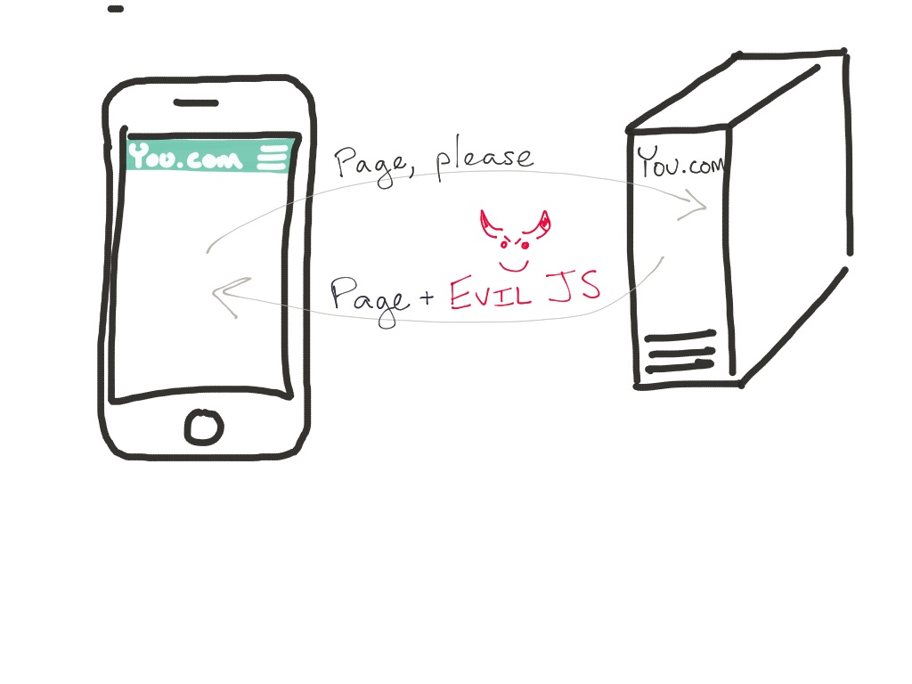

.fx: imageslide

---

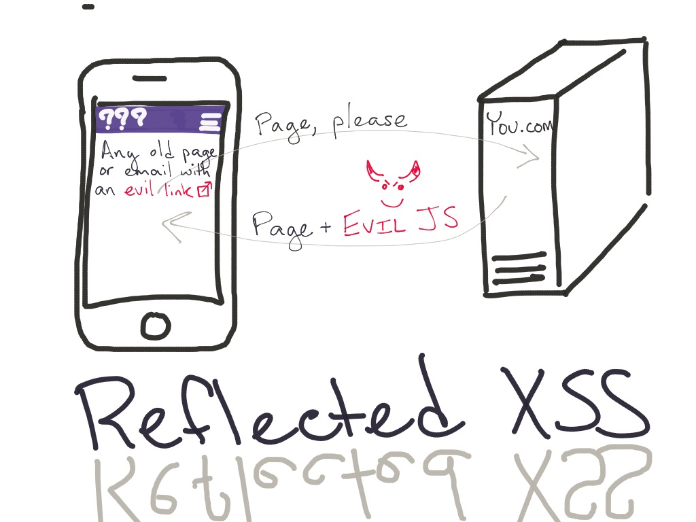

.fx: imageslide

---

## Live Fire: Reflected XSS

	!python
	def greeter(request):
	    who = request.GET.get('name', 'friend')
	    return HttpResponse("Hello, {}".format(who))

[http://vcwa.veryveryvulnerable.com](http://vcwa.veryveryvulnerable.com)

 
 
 
 
 
 
<small>[disclaimer: VCWA is a flask app running similar code.]</small>

.notes: No TLS! The horror! Turns out the game is already over :-P

---

## Live Fire: Reflected XSS

	!python
	def greeter(request):
	    who = request.GET.get('name', 'friend')
	    return HttpResponse("Hello, {}".format(who))

[http://vcwa.veryveryvulnerable.com](http://vcwa.veryveryvulnerable.com)

* "John Baldwin" (our gracious organizer)

---

## Live Fire: Reflected XSS

	!python
	def greeter(request):
	    who = request.GET.get('name', 'friend')
	    return HttpResponse("Hello, {}".format(who))

[http://vcwa.veryveryvulnerable.com](http://vcwa.veryveryvulnerable.com)

* "John Baldwin" (our gracious organizer)
* ``

---

.fx: imageslide

---

.fx: imageslide

---

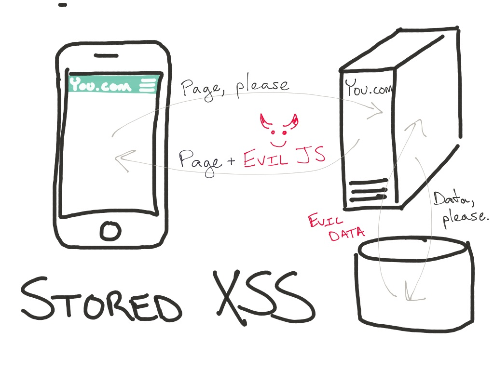

.fx: imageslide

---

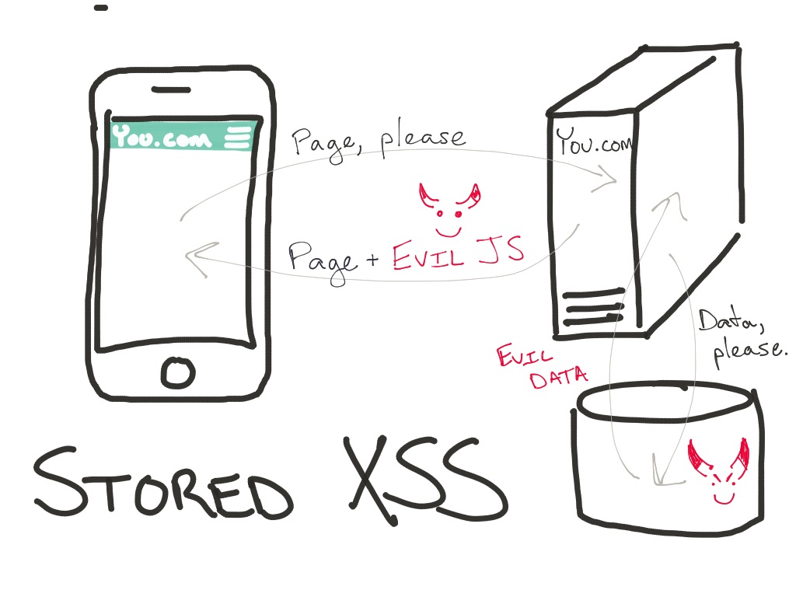

.fx: imageslide

---

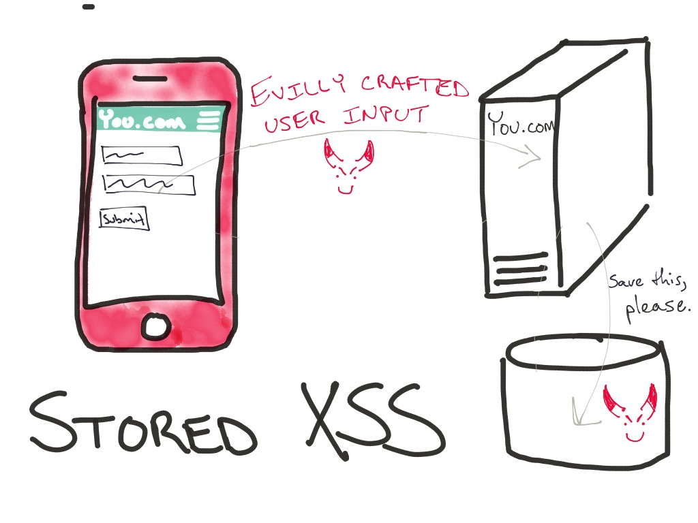

.fx: imageslide

---

## Live Fire: Stored XSS

	!python
	# Flask code, the horror!  This is ~a django view.
	@app.route('/stored', methods=['GET', 'POST'])
	def stored_xss():
	    # store the new message, if there is one
	    if request.method == 'POST':
	        store_message(request.form.get('message'))
	    # either way, give back the list of messages
	    return render_template(
	        'guestbook.html',
	        messages=get_messages()
	    )

[http://vcwa.veryveryvulnerable.com](http://vcwa.veryveryvulnerable.com) (visit the guestbook)

Audience participation: someone please exploit this :-)

.notes: No TLS! The horror! Turns out the game is already over _-P

---

## Live Fire: Stored XSS

	!html
	
		<!-- tell our templating engine not to escape 
		     any HTML.  This way, our users can post 
		     stylish stuff -->
		
		<li>{{ message }}</li>
		
	

[http://vcwa.veryveryvulnerable.com](http://vcwa.veryveryvulnerable.com) (visit the guestbook)

Audience participation: someone please exploit this :-)

.notes: No TLS! The horror! Turns out the game is already over _-P

---

## XSS: Django is your friend

> Again, we stress that [auto-escaping] is on by default. If you’re using Django’s template system, you’re protected.

--Django docs

Safe:

	!html
	
		<li>{{ message }}</li>
	

---

## XSS: Django is your friend

Unsafe:

	!html
	
		<li>{{ message | safe }}</li> 
	

	
	
		<li>{{ message }}</li>
	
	

---

## XSS: Frontend DOM Manipulation Requires the Same Love & Care

Unsafe:

	!javascript
	// Just a sampling... there are many more of each
	$("
" + someText + "
"); // jquery
	$("#some-id").html(someText);     // jquery
	element.innerHTML = someText;     // plain ol' js

---

## XSS: Summary

* Do. Not. Trust. User. Input.
* Escape user input when you render it.  Every  time.
* Just because it came from your server as JSON doesn't mean it's not user input.
* Templating is your friend.
	* Django templating server-side
	* Safe methods or client-side templating

---

# CSRF

---

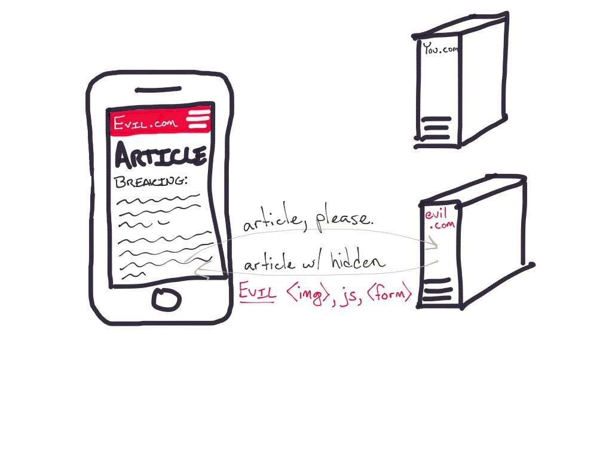

.fx: imageslide

---

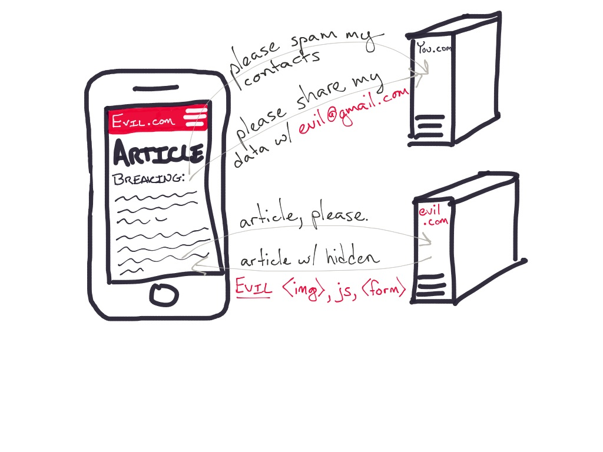

.fx: imageslide

---

## CSRF: Cross Site Request Forgery

> The key to understanding CSRF attacks is to recognize that websites typically don't verify that a request came from an authorized user. Instead they verify only that the request came from the browser of an authorized user.

-- Bill Zeller

.notes: Again, attackers are using the trust you have in a user to do anything a user can do.  Exfiltrate data, change passwords, etc.

---

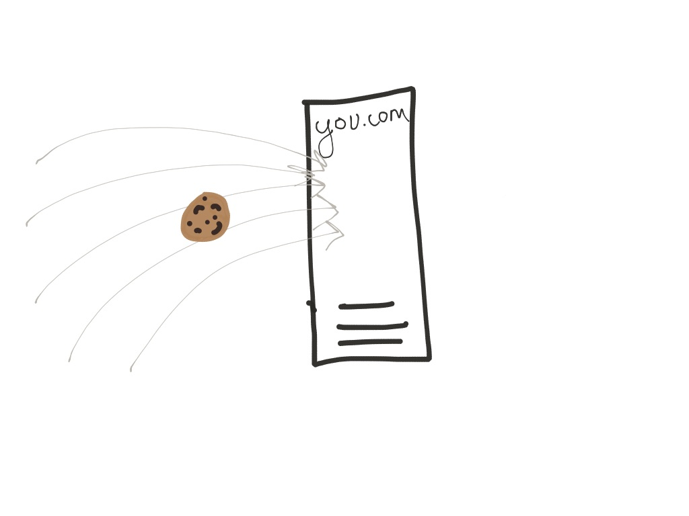

.fx: imageslide

---

## Live Fire: CSRF (back to the guestbook)

	!python
	# Flask code, the horror!  This is ~a django view.
	@app.route('/stored', methods=['GET', 'POST'])
	def stored_xss():
	    # store the new message, if there is one
	    if request.method == 'POST':
	        store_message(request.form.get('message'))
	    # either way, give back the list of messages
	    return render_template(
	        'guestbook.html',
	        messages=get_messages()
	    )

---

## Live Fire: CSRF

	!javascript
	// embedded on any old page you can get the victim
	// to visit
	console.log('muahaha...');
	$.post(
		'http://vcwa.veryveryvulnerable.com/stored',
		{
			message: 'POST with any payload the attacker 
				   wants... on behalf of a real user...'
		}
	);

[http://jthess.com/vvv/csrf.html](http://jthess.com/vvv/csrf.html)
		
---

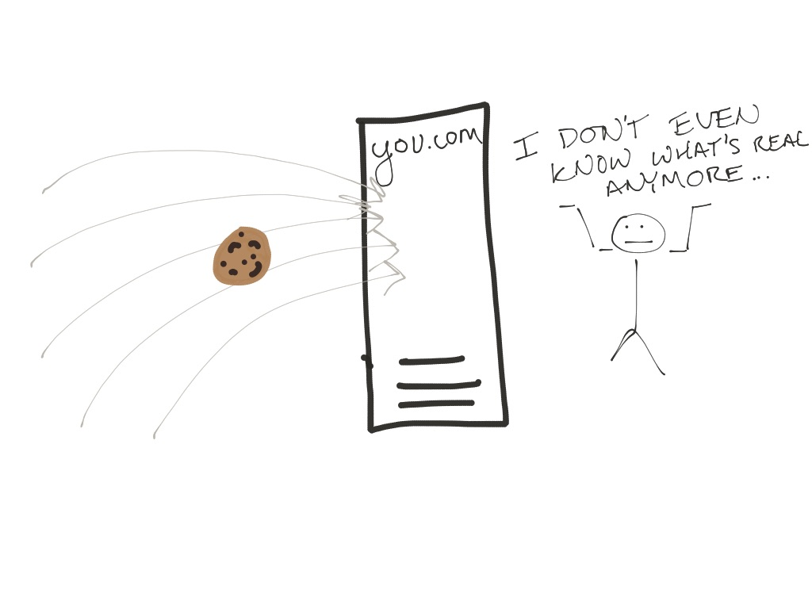

.fx: imageslide

---

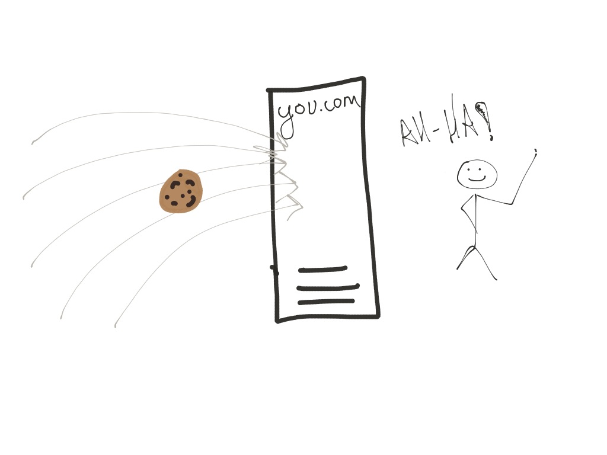

.fx: imageslide

---

## CSRF: Cross Site Request Forgery

Django actually protects you a bit.

	!python
	# in the default settings.py
	MIDDLEWARE = [
	    'django.middleware.security.SecurityMiddleware',
	    'django.contrib.sessions.middleware.SessionMiddleware',
	    'django.middleware.common.CommonMiddleware',
	    'django.middleware.csrf.CsrfViewMiddleware',
	    'django.contrib.auth.middleware.AuthenticationMiddleware',
	    'django.contrib.messages.middleware.MessageMiddleware',
	    'django.middleware.clickjacking.XFrameOptionsMiddleware',
	]

---

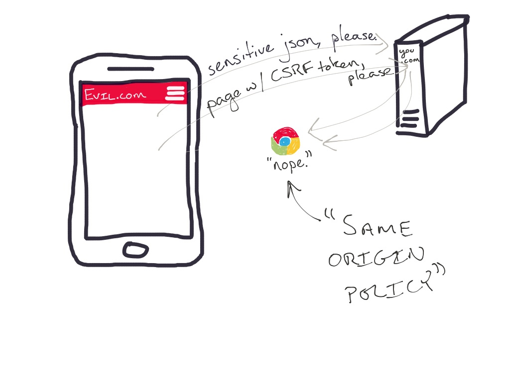

.fx: imageslide

---

## CSRF: Cross Site Request Forgery

So, as long as your server requires proof that whatever's making the request can read from a protected resource, you're in pretty good shape.

That's what the `CsrfViewMiddleware` does.

It puts a random CSRF token in a cookie (and sometimes, a form).  You can only read that token if you are requesting from the same domain.

---

## CSRF: Cross Site Request Forgery

The new and improved <b>guestbook 2.0</b></a> (<a href="http://ssda.veryveryvulnerable.com">http://ssda.veryveryvulnerable.com</a>)

The same old attack doesn't work:
<a href="http://jthess.com/vvv/csrf2.html">http://jthess.com/vvv/csrf2.html</a>

---

## CSRF: Cross Site Request Forgery

CSRF Middleware Failure Modes

---

## CSRF: Cross Site Request Forgery

CSRF Middleware Failure Modes

* Make sure it's turned on.
	* Django Rest Framework doesn't check your CSRF token unless you're using SessionAuthentication  :-|

---

## CSRF: Cross Site Request Forgery

CSRF Middleware Failure Modes

* Make sure it's turned on.
	* Django Rest Framework doesn't check your CSRF token unless you're using SessionAuthentication  :-|
* Misusing "safe" HTTP Methods

---

## CSRF: Cross Site Request Forgery

The victim:

	!python
	# django view
	def nuke(request):
		"""Clears the guestbook message board."""
		# ...check that user is admin/superuser...
		get_db().flushall()
		return HttpResponse('database nuked')

The attack:

	!html
	<!-- Anywhere I can get an admin to visit... maybe a 
		 support forum? -->
	

---

## Live Fire: Abusing Guestbook 2.0

<a href="http://jthess.com/vvv/csrf3.html">jthess.com/vvv/csrf3.html</a>

---

## CSRF: Cross Site Request Forgery

CSRF Middleware Failure Modes

* Make sure it's turned on.
	* Django Rest Framework doesn't check your CSRF token unless you're using SessionAuthentication  :-|
* Misusing "safe" HTTP Methods
* Trusting cookies you don't control

---

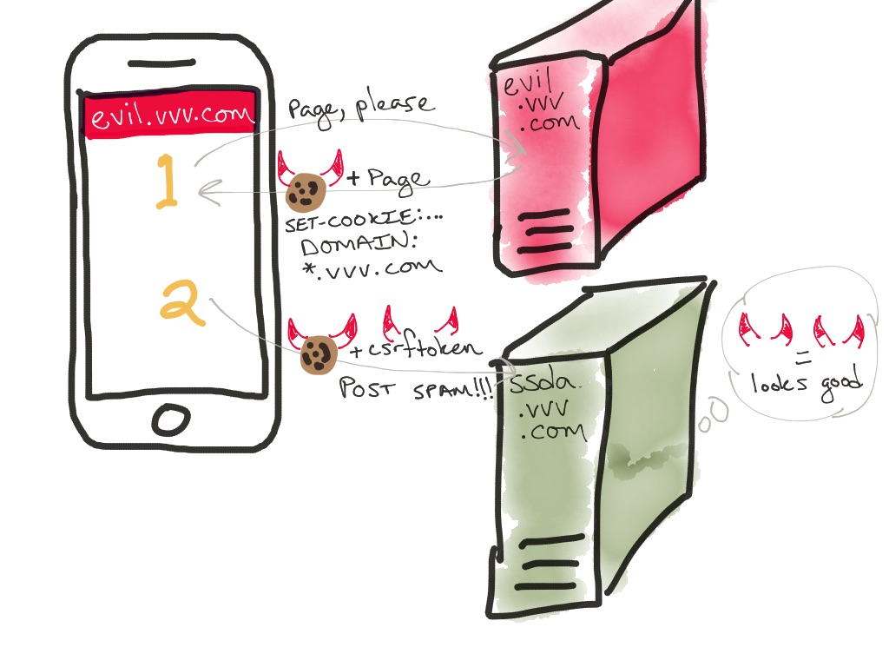

.fx: imageslide

---

## Live Fire: (Still) Abusing Guestbook

<a href="http://evil.veryveryvulnerable.com">evil.veryveryvulnerable.com</a>

---

## CSRF: Cross Site Request Forgery

* What else is running on this domain?  
	* Could it be evil?
	* Could it be vulnerable?
		* Old marketing sites
		* Wordpress blog
* Could your site be running on another domain?
	* You *would never* set `ALLOWED_HOSTS` to `*` ... right?

---

## CSRF: Cross Site Request Forgery

What to do if you're in that situation or might be:

* Store the CSRF token connected to the user's session on the server-side and check against that tamper-proof value
* Cryptographically sign a user/session-associated token with a private key, and, upon the token's return, use that to check that you are the one who generated the value

---

# Questions?

---

 
 
 
 
 
 
 
 
 
 

<small>
Thanks to Morgan Edwards and Ryan Chan

everything's at <a href="http://veryveryvulnerable.com">http://veryveryvulnerable.com</a>
(and either 
	 or )
<small>

---

# One Last Fun Fact

.notes: The public suffix list is why you can't do this on heroku, appengine, and the like.

.fx: titleslide

---

# Backup Slides

---

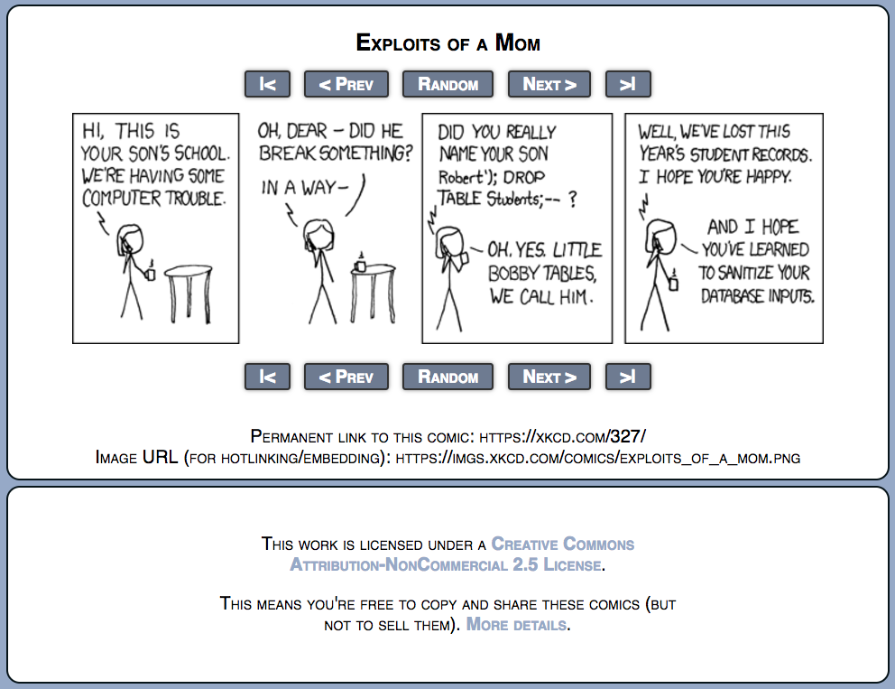

.fx: imageslide

.notes: SQL injection isn't XSS.  But they're cousins of sorts.  If you understand SQL injection, you start to get a sense of what happens when user input becomes code.

.notes: instead of being SQL, it's JS.  instead of being executed on the DB server, it's being executed in users' browsers.

---

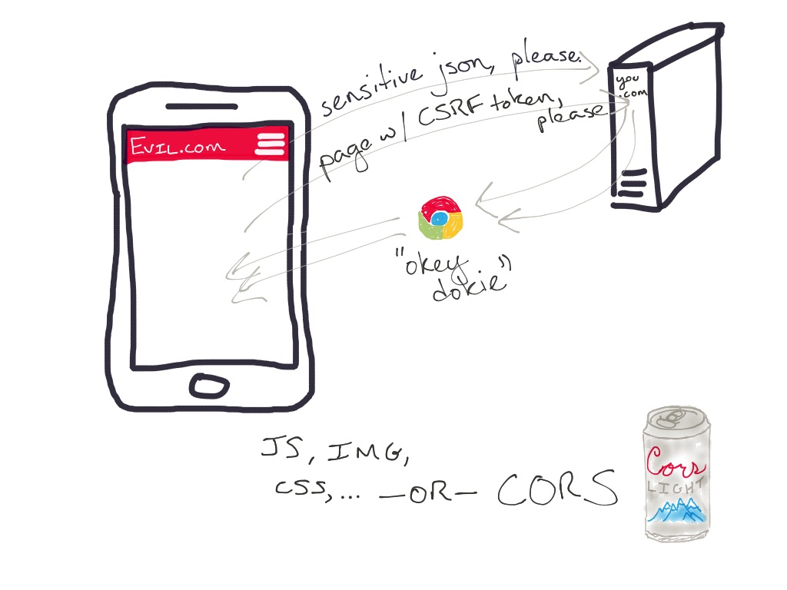

.fx: imageslide

---

# Other things to talk about

* The "public suffix list"
